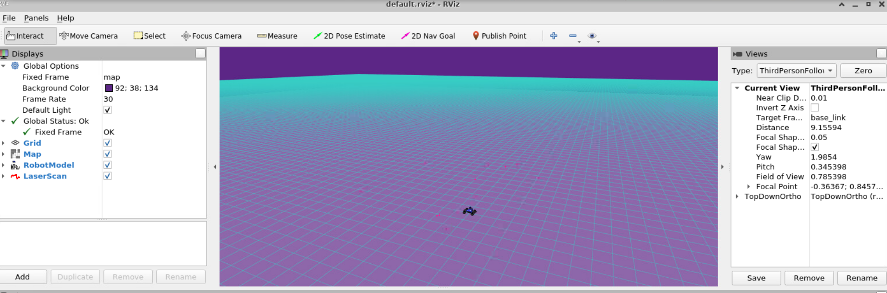
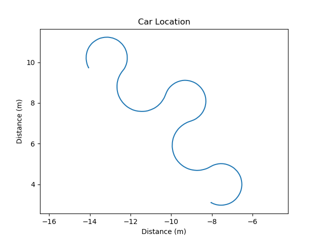

Name: Kofi Ohene Adu
kao65
1.Node: A fundamental component of a computing environment that communicates with other nodes to exchange data, compute computations, or collaborate on tasks
Topic: Labels for information  which make it easier for nodes to subscribe and publish message data.
Publisher: A node responsible for sending data to a specific topic
Subscriber: A node that receives messages from a specific topic.
Hence node are the fundamental components, publishers are nodes that send messages, subscribers are nodes that receives messsages and topics are the labels for these messages

.png)
.png)
