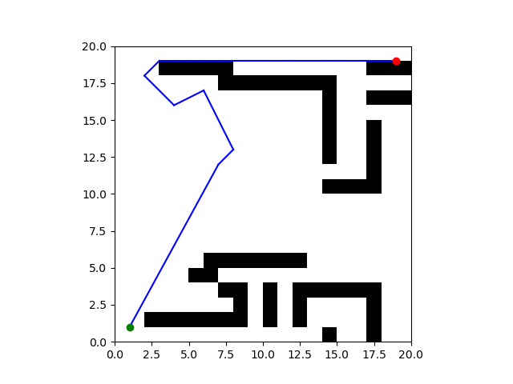
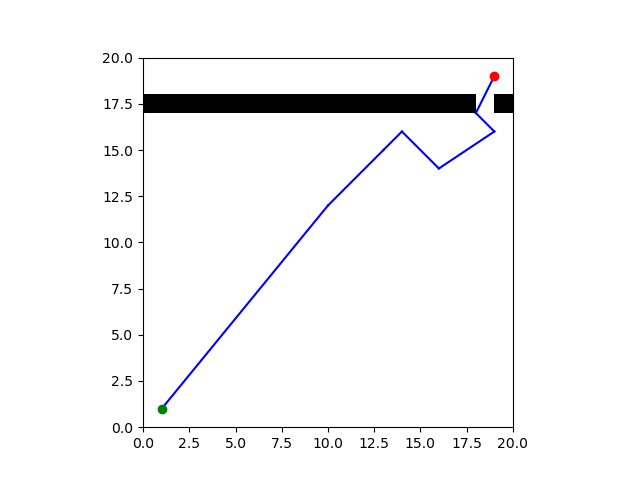

# Project 4: Planning 

Replace this with your own writeup! Please place all figures and answer all questions in this directory.

**Q1.2** A* Shortest Path Figure: 

**Q2.1** RRT Path Figure: 

**Q3**

A* beats RRT Figure: 

A* is better than RRT because it finds the shortest path between the start and goal nodes

RRT beats A* Figure: 

RRT is better than A* because it was more efficient (took less to implement map).

**Q5** A* heuristic design decisions: I found the max value of the minimum distance between -pi and pi