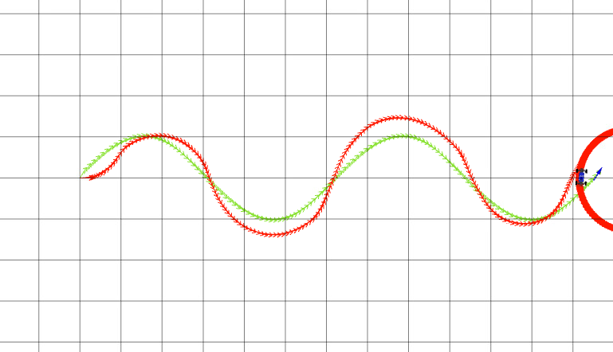
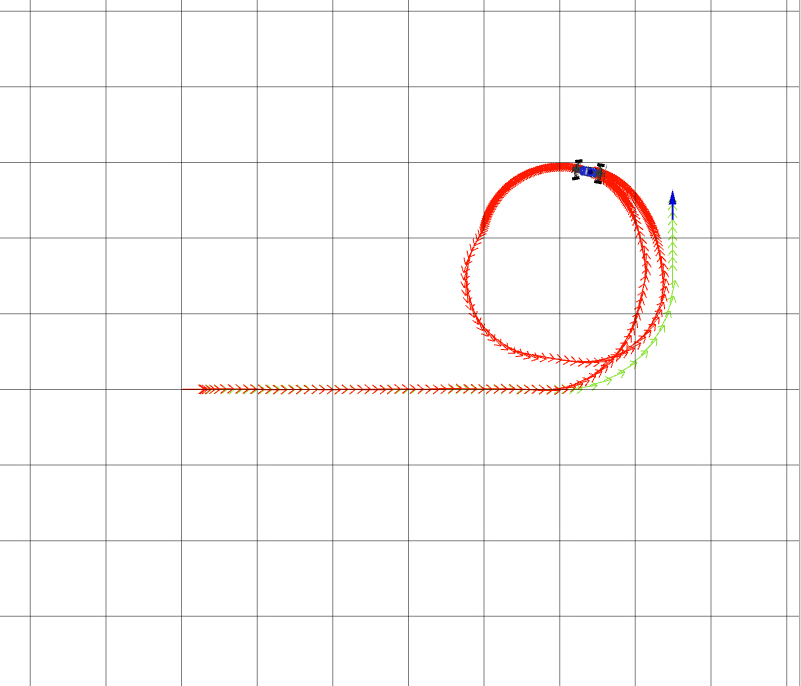

# Project 3: Control 

Replace this with your own writeup! Please place all figures in this directory.
**Q2**
-Decreased all values to 0
-Started by incrementing Kp by increment of 0.1 till a consistent oscillation occurs then obtained 0.6 times it value and placed it as that
-Then increased Ki by 0.01/0.001/0.0001( each degree determined by the average point at whic the perfomance looks consistent) till a value where the car path was closest to the reference path without overshooting too much
-Started incrementing Kd by 0.1/0.01 and found an agreeable average.
-Repeated the cycle multiple times from step 2 though didnt achieve desired results
Wave Figure: 
Circle Figure: 
Left turn Figure: 

**Q4**
-Decreased all values to 0
-Started by incrementing K by increment of 2 till a consistent path occured
-Then increased T by 1 till the car was closest to the obstacle without touching it
-Started incrementing distance_lookahead by 0.1 till the car was closest to the obstacle
-Repeated the cycle multiple times from step 2 